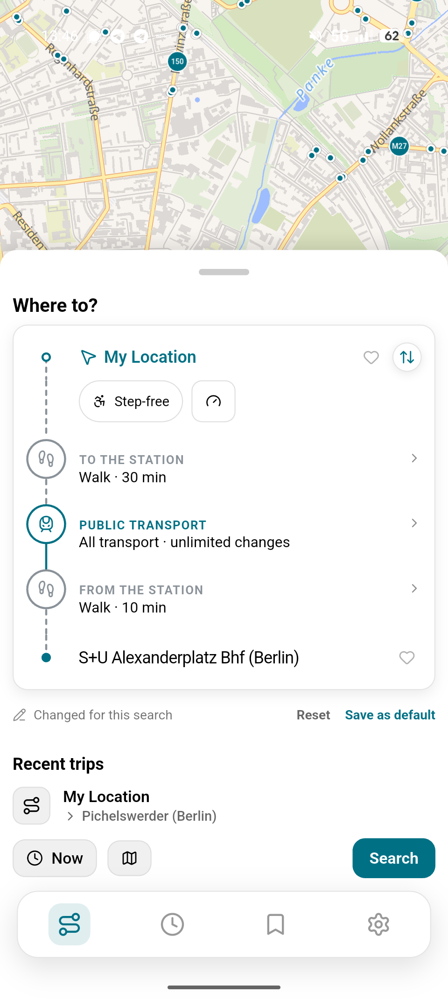
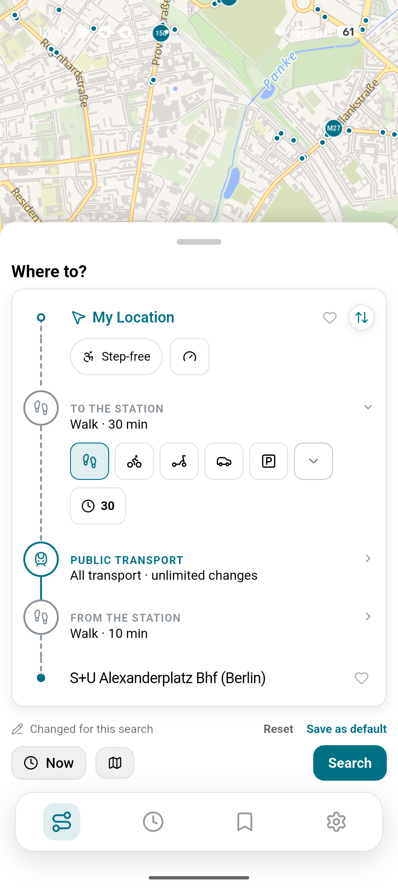
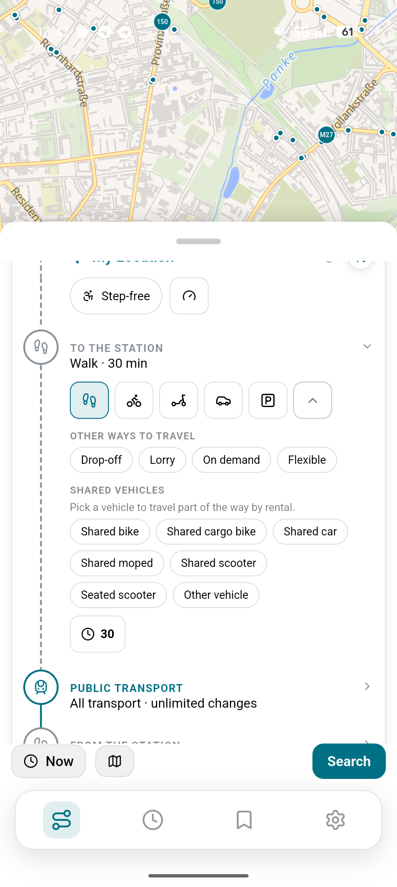
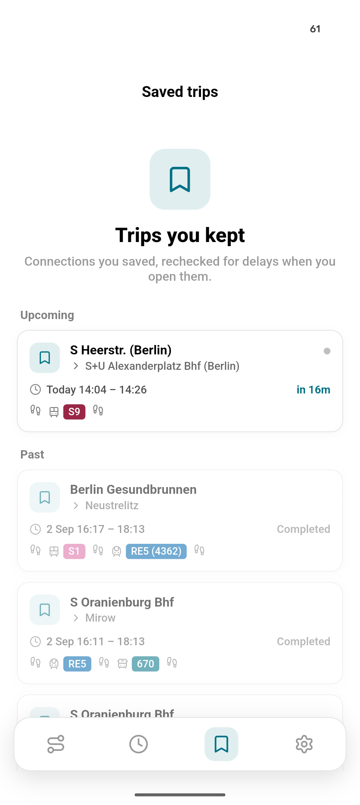
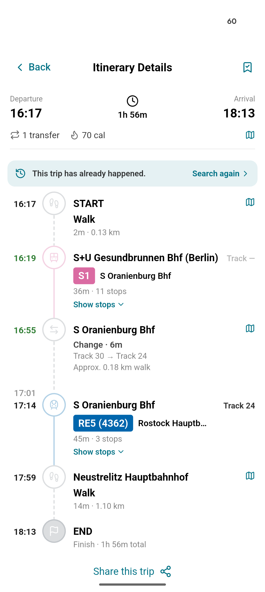
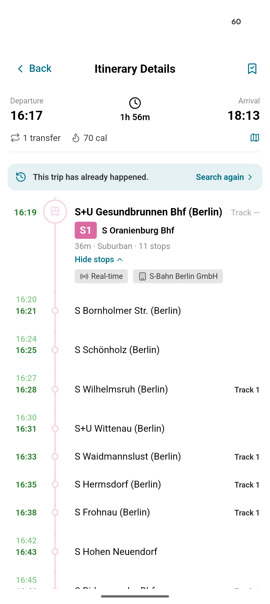

# Transportia+

  

  <b>Transportia+</b> is a fork of
  <a href="https://github.com/Wafler1/transportia">Wafler1/transportia</a>,
  like the original app this fork was mostly programmed by LLM assisted coding. This is mostly a personal project but if you like it feel free to use it and make suggestions.

---

## What this fork adds

- **Saved trips** — keep an itinerary for later, with live times refreshed.
- **A richer search** — pick exact transport modes, via stops, transfers,
  walking/cycling speed and step-free routes right from the search screen.
- **A redesigned journey view** — one continuous timeline from search to
  itinerary, with tappable stops and pull-to-refresh.
- **Side-by-side install** — its own app ID, so it runs next to the original.

## Screenshots

  
  

  
  

  
  

## Install

Add the F-Droid repo: **https://blauertee.github.io/fdroid/**

## What Transportia offers

- **Plan routes with confidence**
  - compare step‑by‑step options
  - see transfers and timing at a glance
- **Understand what’s moving**
  - live map of nearby stops
  - vehicles visible on the map
- **Check stop times fast**
  - upcoming arrivals and departures for any stop
- **Keep essentials handy**
  - save home, work, and favourites
  - start a trip with one tap
- **Stay focused**
  - intentionally simple UI for quick navigation

## The original app

The upstream app (not this fork) is also available on Google Play and
IzzyOnDroid:

  

## Suggestions, issues, or bugs

For this fork, open an issue here:

- https://github.com/blauertee/transportia/issues/new/choose

For the upstream app, use Wafler1's tracker instead:

- https://github.com/Wafler1/transportia/issues/new/choose

When reporting a bug, include:
- device + OS version
- steps to reproduce
- expected vs actual behavior
- screenshots or screen recordings if possible

## Contributing

Contributions are welcome! It'd be nice not to work on this alone. A few
things that make it easier for both of us:

**Open an issue before you build.** With LLM assisted coding, adding features
has become VERY simple, so writing the code isn't the expensive part anymore.
Agreeing on what the app should be is. Before you pour a lot of work into
something, open an issue and describe what you're planning and why. Tell me
the use case, not just the feature. That way we can discuss it first, and you
don't end up with a big PR that I have to push back on.

**Keep PRs small.** One feature or fix per PR. If a PR does five things and I
like three of them, I can't just merge those three. Small PRs get reviewed and
merged fast; big ones get stuck on whichever part we disagree on.

**Where I want the app to go.** I want to keep it focused and minimal: a MOTIS
client that supports the complete feature set of the API while offering
maximal usability. Customization in the settings is a good thing where a
compromise that fits most people can't be reached, but an app that doesn't
need users to go into the settings at all is always superior. When in doubt,
let's learn from the people with money for usability in UI design (Google
Maps). I also prefer simple, predictable solutions over clever heuristics
that can be wrong, especially when they cost battery or add a lot of
complexity.

And honestly: given how easy it is to vibe-fork this app, maintaining your own
version is a perfectly fine option where we can't find a compromise. No hard
feelings.

**The practical bits:**
- Open PRs against `dev-build`. Every merge there ships a release to testers,
  so I do the merging.
- Run `flutter analyze`, `flutter test` and `dart format .` before pushing.
- Add screenshots for anything the user can see.
- If you code with an agent, point it at [AGENTS.md](AGENTS.md); it has the
  repo's conventions.

## Thanks to

<a href="https://transitous.org/">Transitous</a> - Free and open public transport routing.

<a href="https://maplibre.org/">MapLibre GL</a> - Interactive vector tile maps in the browser.

<a href="https://lucide.dev/">Lucide</a> - Beautiful & consistent icon toolkit made by the community.
